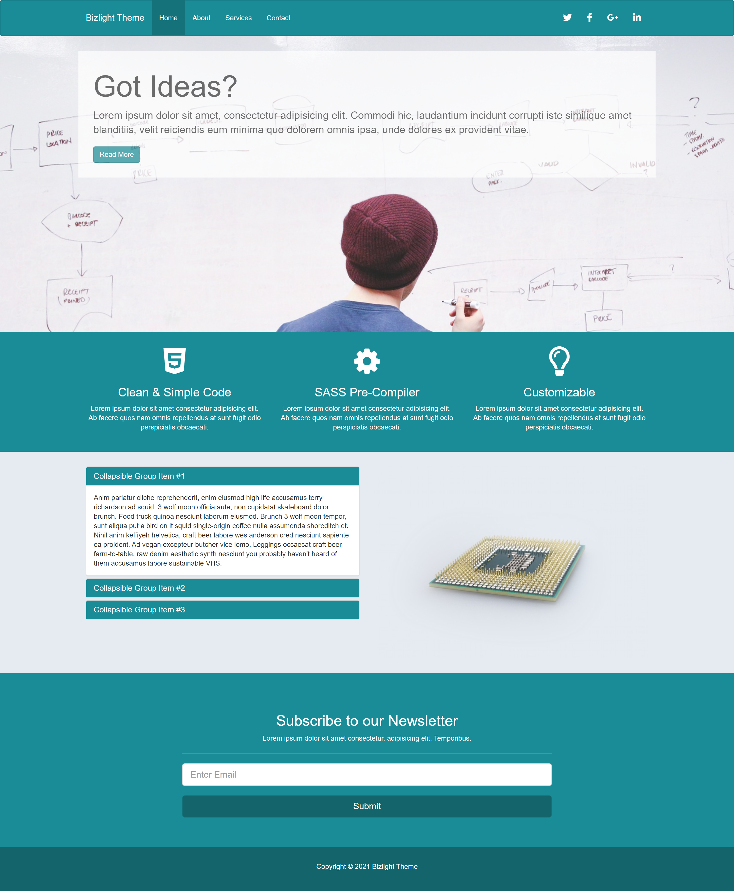
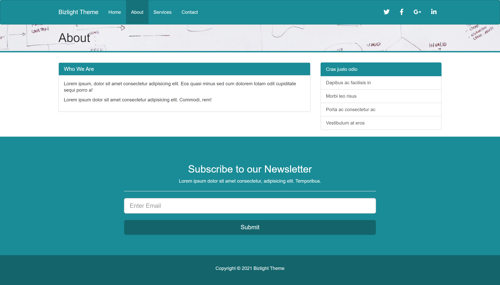
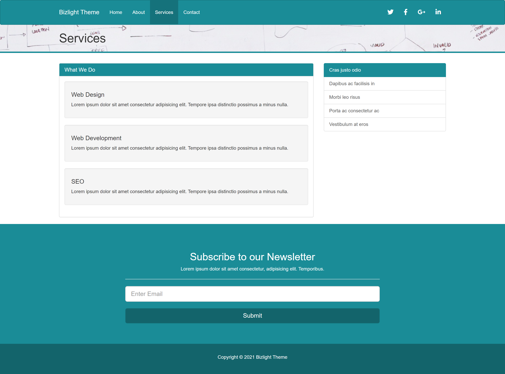
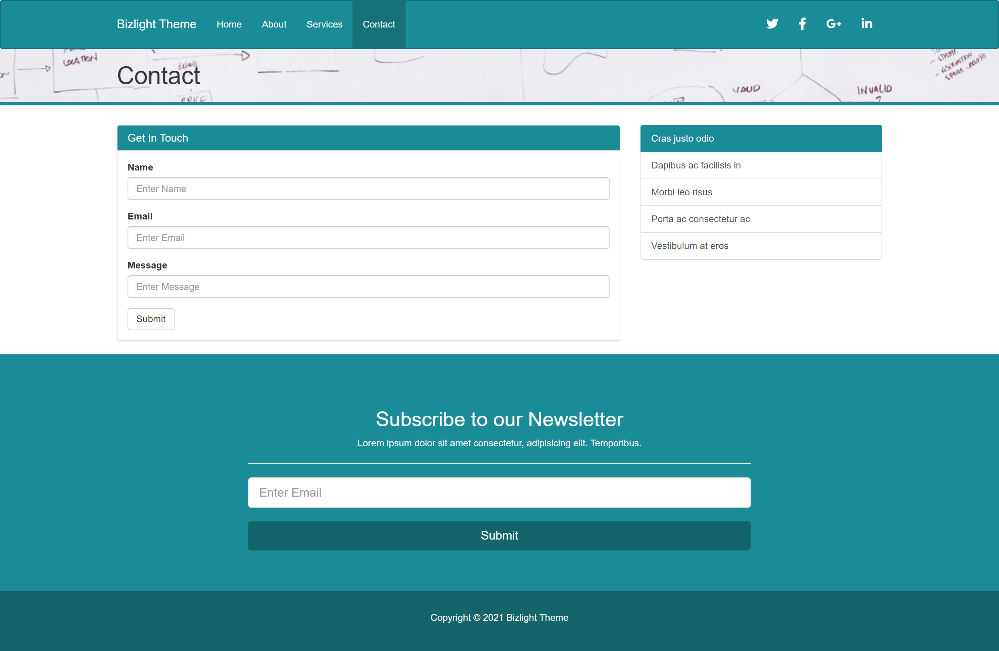

# Custom Twitter Bootstrap Theme with SASS

### About

Here we create a custom Twitter Bootstrap theme utilizing the SASS CSS pre-compiler. Other technologies covered: Koala, Bower, Live-Server and Font-Awesome.

### Screenshots

### Life Update

After seven months of unemployment and unsuccessfully unable to find an entry level web development gig (thanks for nothing coding bootcamp), I re-entered the workforce basically starting from scratch at 41 years old. thankfully, the job market is competitive enough right now that I was able to land a fun job as a blue-collar forklift driver for a local employer. it's not the most glamorous line of work, and it's a little dangerous, but i like it, and it pays the bills. that being said, i'm working three consecutive 12 hour days a week, so meeting my goal of getting commits everyday on Github will prove nearly impossible. i will still get those boxes turned greened on my commit history and continue to self-teach on the days I can. this is important to me, and more importantly, it's a fun hobby I am interested in. maybe a few years down the line I can hopefully find an employer who wants a smart, talented and dedicated coder to help build websites.

### Acknowledgement

Thanks to Traversy Media for another amazing tutorial!
